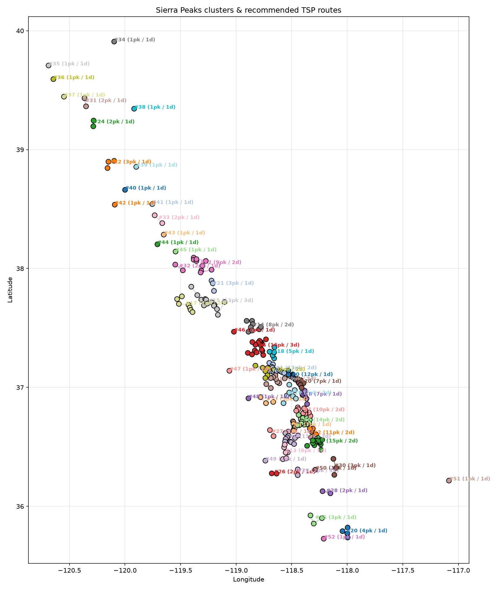

# Sierra Peaks Clustering

A Python tool that clusters the **Sierra Peaks Section (SPS)** list — all 247
peaks — into efficient **1–3 day peak-bagging trips**, orders each trip with a
Traveling-Salesman solver to minimize backtracking, ranks trips by efficiency,
and exports the itineraries as JSON.

It models off-trail, class 1–2 travel between summits using **great-circle
distance** for the horizontal component and **Naismith's Rule** to convert
vertical ascent into equivalent effort. Permit logistics are out of scope — this
focuses on the geographic/physical optimization.

Running it on the real SPS list produces mountaineering-sound groupings: the
Palisades traverse, the Evolution group, the Whitney/Williamson group, the Mono
Divide, the Sawtooth/Matterhorn cluster, and so on.

---

## Data

The bundled dataset (`data/sps_peaks.csv`) is built from the **official Sierra
Club sources** and joined to authoritative **USGS GNIS** coordinates. The
processed CSV is committed and ready to use; the copyrighted Sierra Club source
documents themselves are **not redistributed here** (download them yourself to
rebuild — see [`DATA_LICENSE.md`](DATA_LICENSE.md) and `data/source/README.md`):

| Source | Used for | Bundled? |
|--------|----------|----------|
| `sps_list_with_mileage.xls` (29th ed., 2025) | 247 SPS peaks: elevation, class, section, round-trip mileage, gain/loss, trailhead, USGS quad, emblem/mountaineers flags | No (© Sierra Club) |
| `scrambler_ratings_non_sps_2025.pdf` | 354 non-SPS High Sierra peaks (labeled `non-SPS`, out of scope for clustering but tracked) | No (© Sierra Club) |
| USGS GNIS California + Nevada state files | decimal lat/long for every peak, matched on **name + USGS quad** | Yes (public domain) |

All 247 SPS peaks have coordinates: **241 from GNIS** (incl. 14 spelling/wording
aliases like *Foerster*↔*Forester*, *Maclure*↔*MacClure*) and **6 unofficially
named peaks** (Taylor Dome, Spanish Needle, Rockhouse Peak, Cartago Peak, North
Maggie Mountain, Clyde Minaret) from peakbagger.com. Each row records its
`coord_source`.

### Rebuilding the dataset

Only needed to rebuild from scratch; requires the Sierra Club source documents
in `data/source/` (not bundled — the scripts print a download reminder if
missing).

```bash
# 1. Parse the Sierra Club sources -> data/sps_peaks.csv (coords blank)
python scripts/build_dataset.py

# 2. Join GNIS coordinates (uses the committed Sierra subset)
python scripts/merge_gnis.py
```

`scripts/merge_gnis.py` holds the curated alias map and the 6 manual
peakbagger coordinates; `data/source/gnis_sierra_summits.txt` is a trimmed
Sierra-box GNIS subset committed for reproducibility.

### Trailheads

`data/trailheads.csv` is a curated list of ~40 major east-, west-, and
crest-side Sierra trailheads with lat/long (coordinates to ~0.001° and
spot-checked against public sources such as the PCTA and NPS). Run

```bash
python scripts/assign_trailheads.py
```

to add `nearest_trailhead`, `nearest_trailhead_side`, and
`nearest_trailhead_mi` (straight-line) columns to `data/sps_peaks.csv`. The
nearest-trailhead is a cleaner access signal than the raw `trailhead` text and
can be used directly for clustering (`--trailhead-field nearest_trailhead`).

### Mountain passes (crest-aware routing)

`data/passes.csv` is the Sierra pass dataset (sourced from USGS GNIS feature
class `Gap`; see [`data/source/README.md`](data/source/README.md) to rebuild and
backfill elevations). Each pass carries a **tier**: tier 1 = named passes/cols
(default crossing set, and the points that define the crest line); tier 2 =
minor gaps/saddles.

Pass routing is **opt-in**. By default all distances are straight-line. With
`--use-passes`, a leg between two points on opposite sides of the Sierra crest
is routed over the cheapest pass instead of tunnelling through the ridge; a leg
that stays on one side is still direct (you don't always cross a pass to reach a
peak). This affects clustering, the TSP order, the reported mileage/gain, and
adds a `passes_crossed` list per trip in the JSON.

```bash
python cli.py -i data/sps_peaks.csv --use-passes            # named passes only
python cli.py -i data/sps_peaks.csv --use-passes --pass-tier 2   # also minor gaps
python scripts/assign_trailheads.py --use-passes            # crest-aware approach
```

The crest is approximated by a monotone longitude/latitude line fit over the
tier-1 passes, so peaks sitting almost *on* the crest can be assigned a side
coarsely; denser pass data (`merge_passes.py --add-all`) sharpens it.

### Input schema

Minimum required columns are `name`, `latitude`, `longitude`, `elevation_ft`
(common aliases like `lat`/`lon`/`elevation` are accepted). The full dataset
also carries `list`, `class`, `section`, `emblem`, `mountaineers`,
`mileage_rt`, `gain_ft`, `loss_ft`, `trailhead`, `quad`, `coord_source`,
`benchmark`/`benchmark_rating` (see `scripts/parse_benchmarks.py`) and
`nearest_trailhead*` (see `scripts/assign_trailheads.py`), which flow through to
the JSON export as per-peak `attributes`. JSON input is also supported (a list
of objects, or `{"peaks": [...]}`).

---

## How it works

```
peaks (CSV/JSON)
      │  (filter to one list, e.g. SPS; skip rows without coordinates)
      ▼
┌─────────────────────────┐   great-circle distance (haversine)
│ 1. Spatial grouping     │   Naismith effort adjustment for ascent
│    DBSCAN over a        │
│    distance matrix      │
└─────────────────────────┘
      │  natural geographic groups (outliers → singleton trips)
      ▼
┌─────────────────────────┐   any group whose route exceeds the trip budget
│ 2. Capacity splitting   │   (max_days × miles_per_day) is split with
│    agglomerative split  │   agglomerative clustering until every trip fits.
└─────────────────────────┘   Feasibility uses a fast nearest-neighbor upper
      │                        bound, so statewide (~250 peak) runs stay quick.
      ▼
┌─────────────────────────┐   exact brute force (≤ 8 peaks)
│ 3. TSP ordering         │   nearest-neighbor + 2-opt (larger)
│    open Hamiltonian path│
└─────────────────────────┘
      │
      ▼
┌─────────────────────────┐   score = peaks / (1 + effective_mi / 10)
│ 4. Rank + export JSON   │
└─────────────────────────┘
```

### Distance & effort model

- **Horizontal distance**: great-circle (haversine) miles between summits — a
  good proxy for off-trail class 1–2 travel.
- **Naismith's Rule**: 1 hr per 3 horizontal miles + 1 hr per 2000 ft ascent, so
  2000 ft of climbing ≈ 3 "effective" flat miles. Effective miles are summed
  leg-by-leg; descending adds no penalty (standard simple form).
- **Trip budget**: `max_effective_mi = miles_per_day × max_days` (default
  `15 × 3 = 45`). Estimated days = `ceil(effective_mi / miles_per_day)`, capped
  at `max_days`.

---

## Installation

```bash
cd projects/sierra-peaks-clustering
pip install -r requirements.txt   # pandas, numpy, scikit-learn, scipy, networkx, geopy; matplotlib for --viz
```

Python 3.10+.

---

## Usage

```bash
# Cluster the full SPS list (SPS-only is the default when a 'list' column exists)
python cli.py --input data/sps_peaks.csv --output out.json --viz clusters.png
```

```
53 trips | 247 peaks | 69 trip-days | 407.43 horiz mi | 43081 ft gain

 #  pk  days  horiz_mi   eff_mi   gain_ft   score  route
 0  12     1       9.0     11.2      1479    5.66  Disappointment Peak -> Middle Palisade -> Norman Clyde Peak -> ...
 1  13     2      14.1     16.1      1332    4.98  Mount Goethe -> Mount Lamarck -> Mount Mendel -> MOUNT DARWIN -> ...
 2  11     2      12.4     15.8      2211    4.27  Mount Young -> Mount Hale -> Mount Muir -> MOUNT WHITNEY -> ...
 ...
```

### Options

| Flag | Default | Description |
|------|---------|-------------|
| `--input, -i` | *(required)* | peak CSV or JSON file |
| `--output, -o` | – | write ranked itineraries to this JSON file |
| `--list` | `SPS` | keep only this `list` value (`all` keeps everything) |
| `--eps-mi` | `6.0` | spatial grouping radius (horizontal miles) |
| `--miles-per-day` | `15.0` | effective hiking miles per day |
| `--max-days` | `3` | maximum days per trip |
| `--method` | `dbscan` | grouping method: `dbscan` or `agglomerative` |
| `--exclude` | – | comma-separated peak names to drop |
| `--force-together` | – | comma-separated peaks to keep in one trip (repeatable) |
| `--merge` | – | comma-separated cluster IDs to merge, then re-plan (repeatable) |
| `--split` | – | split a cluster: `ID:K` (repeatable) |
| `--viz` | – | write a matplotlib PNG (per-peak labels auto-hide above 40 peaks) |

### Manual tweaking

```bash
# Force the Palisade 14ers together, exclude a sub-peak, tighten the daily budget
python cli.py -i data/sps_peaks.csv \
    --force-together "NORTH PALISADE,Polemonium Peak,Thunderbolt Peak,Mount Sill" \
    --exclude "Mount Muir" --miles-per-day 12 --max-days 2

python cli.py -i data/sps_peaks.csv --merge 5,6      # merge trips #5 and #6, re-plan
python cli.py -i data/sps_peaks.csv --split 4:2      # split trip #4 into 2
```

`--merge` applies to first-pass IDs; `--split` applies afterward. After each
edit the trips are re-ordered (TSP) and re-ranked so metrics stay consistent.

### Python API

```python
from sierra_peaks import load_peaks, ClusterConfig
from sierra_peaks.pipeline import plan_trips
from sierra_peaks.export import save_json

peaks = load_peaks("data/sps_peaks.csv", list_filter="SPS")
clusters = plan_trips(peaks, ClusterConfig(eps_mi=6, miles_per_day=15, max_days=3))
save_json(clusters, "out.json")
```

---

## Output schema (`examples/sps_full_output.json`)

```jsonc
{
  "summary": { "num_clusters": 53, "total_peaks": 247, "total_estimated_days": 69,
               "total_distance_mi": 407.43, "total_elevation_gain_ft": 43081 },
  "clusters": [
    {
      "cluster_id": 0,
      "num_peaks": 12,
      "peaks": [ { "name": "MOUNT SILL", "latitude": 37.0942, "longitude": -118.5042,
                   "elevation_ft": 14159,
                   "attributes": { "list": "SPS", "class": "3", "section": 14.4,
                                   "emblem": false, "mountaineers": false,
                                   "mileage_rt": 11.9, "gain_ft": 7685, "trailhead": "...",
                                   "quad": "North Palisade", "coord_source": "GNIS" } } ],
      "recommended_order": ["Disappointment Peak", "Middle Palisade", "..."],
      "total_distance_mi": 9.0, "total_effective_mi": 11.2,
      "total_elevation_gain_ft": 1479, "estimated_days": 1,
      "efficiency_score": 5.66, "emblem_peaks": 1, "mountaineers_peaks": 4
    }
  ]
}
```

`total_distance_mi`/`total_effective_mi`/`total_elevation_gain_ft` are the
**inter-peak** route totals the optimizer computes; each peak's `attributes`
also carry the official **per-peak round-trip** `mileage_rt`/`gain_ft` from the
trailhead, for reference.

---

## Example: statewide SPS plan (default settings)

53 trips across the range. A few of the top-ranked:

| # | Peaks | Days | Eff. mi | Gain | The group |
|---|------:|-----:|--------:|-----:|-----------|
| 0 | 12 | 1 | 11.2 | 1,479 | **Palisades** — Middle Pal, Norman Clyde, Sill, N. Palisade, Thunderbolt, Agassiz, Temple Crag … |
| 1 | 13 | 2 | 16.1 | 1,332 | **Evolution** — Darwin, Mendel, Lamarck, Goethe, Huxley, Haeckel, Powell, Thompson, Goode … |
| 2 | 11 | 2 | 15.8 | 2,211 | **Whitney/Williamson** — Whitney, Muir, Russell, Williamson, Tyndall, Barnard … |
| 3 | 7 | 1 | 6.9 | 676 | **Brewer group** — Brewer, North/South Guard, Table, Midway, Milestone … |
| 6 | 16 | 3 | 33.6 | 2,710 | **Mono Divide** — Abbot, Mills, Gabb, Dade, Bear Creek Spire, Hilgard, Recess … |
| 12 | 9 | 2 | 22.5 | 793 | **Sawtooth/Matterhorn** — Matterhorn, Whorl, Virginia, Conness, North Peak, Dunderberg … |



A small 30-peak demo dataset (`data/sps_sample.csv`) and its output are also
included for quick experimentation.

---

## Project layout

```
sierra-peaks-clustering/
├── cli.py                       # command-line entry point
├── requirements.txt
├── data/
│   ├── sps_peaks.csv            # authoritative 247 SPS + 354 non-SPS peaks
│   ├── sps_sample.csv           # 30-peak demo subset
│   └── source/                  # official Sierra Club files + trimmed GNIS subset
├── scripts/
│   ├── build_dataset.py         # XLS + non-SPS PDF -> sps_peaks.csv
│   ├── merge_gnis.py            # join GNIS coordinates (name + quad)
│   └── merge_coords.py          # generic GPX/KML/CSV/JSON coordinate joiner
├── examples/
│   ├── sps_full_output.json     # statewide 53-trip plan
│   ├── sps_full_clusters.png    # statewide map
│   └── example_output.json      # demo-dataset output
├── sierra_peaks/
│   ├── model.py                 # Peak / Cluster
│   ├── data_loader.py           # CSV/JSON loading, list filter, metadata
│   ├── distances.py             # haversine + Naismith effort model
│   ├── clustering.py            # DBSCAN grouping + capacity splitting
│   ├── tsp.py                   # open-path TSP (brute force / 2-opt)
│   ├── pipeline.py              # cluster → order → score → rank
│   ├── manual.py                # merge / split / exclude / force-together
│   ├── export.py                # JSON export
│   └── visualize.py             # optional matplotlib map
└── tests/
    └── test_pipeline.py         # 16 unit/integration tests
```

Run the tests: `python tests/test_pipeline.py` (or `python -m pytest tests/`).

---

## Notes, assumptions & extension points

- **Off-trail assumption.** Inter-peak travel is straight-line great-circle
  distance, appropriate for class 1–2 ridge/basin travel. It does not model
  cliffs, technical terrain, or the approach from the trailhead to the first
  peak (the official per-peak `mileage_rt`/`gain_ft` are carried for that).
- **Trail-network distances (optional).** The distance layer is isolated in
  `distances.py`; swap `build_distance_matrix` for shortest paths over a
  `networkx` graph built from USFS/NPS trail shapefiles, and everything
  downstream is unchanged.
- **Elevation gain** is the sum of positive summit-to-summit deltas along the
  route — a lower bound that ignores intermediate ups-and-downs.
- **Permits** are intentionally out of scope.
```

---

## License & data

The **source code** is licensed under the [MIT License](LICENSE).

The **data** has separate provenance and terms — see
[`DATA_LICENSE.md`](DATA_LICENSE.md). In particular, the Sierra Club source
documents in `data/source/` are copyrighted; review `DATA_LICENSE.md` before
making a public copy of this repository. Peak data derives from the Sierra Club
SPS list and **USGS GNIS** (public domain); map tiles are © OpenStreetMap
contributors / OpenTopoMap (CC-BY-SA) / Esri.

## Contributing

Contributions welcome — see [`CONTRIBUTING.md`](CONTRIBUTING.md) and our
[`CODE_OF_CONDUCT.md`](CODE_OF_CONDUCT.md). Please run the tests and cite
sources for any data corrections.
