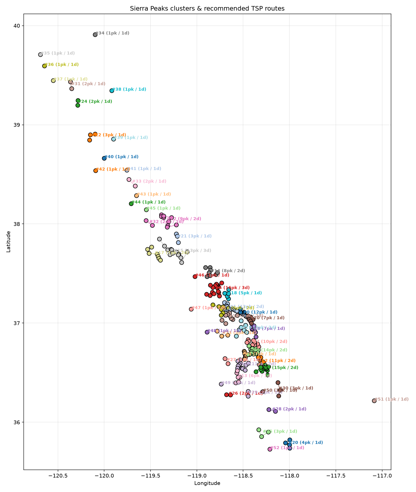

# Backcountry Trip Planner

Open-source, source-backed logistics for hiking, trail running, backpacking, and
mountaineering. Sierra Nevada first; designed to expand to U.S. public lands.

Turn an outdoor objective into a trip you can actually execute: approaches,
access, effort, permits, booking deadlines, and evidence.

This repository began as a tool for grouping the Sierra Peaks Section (SPS) list
into possible multi-peak trips. That experimental geographic-planning code is
still part of the project, but it exposed a more important problem: in the
mountains, proximity is not the same thing as feasibility.

Two summits can be close on a map and still be separated by technical ridges,
cliffs, difficult talus, snow or ice, creek crossings, private land, major
descents and reclimbs, or simply no sensible route connection.

The project is therefore evolving around a different question:

**I want to do this objective on this date. What do I need to know and do to make
the trip happen?**

Today the data and tooling are Sierra Nevada- and SPS-focused. The longer-term
architecture is intended to support other U.S. public lands without pretending
that nationwide coverage exists yet.

## The Planning Problem

Suppose you want to climb Mount Williamson and Mount Tyndall over three days in
July 2027.

Knowing that the summits are geographically near one another is useful, but it
is not enough to plan the trip.

The useful questions are:

- Do the objectives share a practical or commonly used approach?
- Which trailhead or wilderness entry point is relevant?
- Which wilderness area and land-management agency control the entry?
- Which permit product or permit group applies?
- When does reservation inventory become available?
- Is there a later or fallback release window?
- What approach effort is involved before the summit-to-summit portion even
  begins?
- Which facts are directly supported by source data, which are inferred, and
  which remain uncertain?
- What official sources support the access and permit rules?

That relationship between objective -> approach -> access -> permit -> timing ->
evidence is the direction of the project.

Backcountry Trip Planner is not intended to replace CalTopo, Gaia GPS,
AllTrails, Strava Routes, or other detailed mapping and navigation tools. Those
products are better suited to drawing, inspecting, and navigating exact routes.
This project is focused on the logistical knowledge around the trip: what access
applies, what rules matter, when you need to act, and what evidence supports the
answer.

## `plan`: Objective + Date -> Logistics

`plan.py` is that answer, for objectives you already know you want to do. Unlike
`cli.py`'s experimental geographic clustering (which discovers and groups
objectives from a whole peak list), `plan` takes specific, named objectives and
resolves access, permit, and evidence logistics for them directly -- no
clustering or route discovery involved.

```bash
python plan.py "Mount Williamson" "Mount Tyndall" --date 2027-07-15
```

```text
MOUNT WILLIAMSON + MOUNT TYNDALL
Trip date: 2027-07-15

Access
  Trailhead: Shepherd Pass  (east side)

Permit
  Wilderness: John Muir Wilderness  |  Agency: Inyo National Forest
  Permit: Inyo NF Wilderness Permit (John Muir / Ansel Adams / Golden Trout-Inyo / Hoover-Inyo entries)
  Status: Reservations open 2027-01-14 (07:00 America/Los_Angeles) -- mark your
  calendar. A further 40% release opens 2027-07-01 (07:00 America/Los_Angeles).
  Fee: $6/permit + $5/person ($15/person if the trip enters or exits via the Mt. Whitney Zone)
  Apply: https://www.recreation.gov/permits/233262
  Provenance: source last updated 2026-07-08; we last checked this against the
  source on 2026-07-23.

Known per-objective mileage (official round trip, from source data)
  MOUNT WILLIAMSON: 12.9 mi round trip, 8,990 ft gain
  Mount Tyndall: 11.1 mi round trip, 8,360 ft gain
  These are each objective's own official round-trip stats from its standard
  trailhead -- not a computed combined route. Whether they can reasonably be
  linked into one continuous trip is not modeled here; treat as reference
  points, not a verified itinerary.

Planning aid, not a booking guarantee -- verify the current rule at the
official source before acting on any date above.
```

A trailhead shared by objectives with different actual approaches -- e.g. Mount
Whitney and Mount Russell from Whitney Portal -- surfaces both permits it
actually needs, using the same approach-relationship data described below:

```bash
python plan.py "Mount Whitney" "Mount Russell" --date 2027-07-01
```

`--output plan.json` writes the same resolution as structured JSON (objectives,
trailhead, every permit entry, warnings) for downstream use.

**Current scope, deliberately:** `plan`'s objectives must share a single
trailhead, the same assumption made everywhere else access is modeled in this
project. Objectives that don't share one aren't rejected -- `plan` still
resolves its best guess and reports the mismatch as an explicit warning rather
than silently trusting it. A loop or point-to-point traverse with a genuinely
different entry and exit is a natural next step, not something this models yet.

```bash
python plan.py --help
```

## What The Project Can Do Today

The current implementation is centered on the Sierra Nevada and the Sierra Peaks
Section dataset.

It can:

- Resolve access, permit, and evidence logistics for a specific, named set of
  objectives and a trip date (`plan.py`), without going through the
  experimental clustering pipeline.
- Load the 247-peak SPS list with summit coordinates, elevation, class, section,
  emblem and mountaineers flags, mileage/gain fields, trailhead metadata, USGS
  quad, and source metadata.
- Work with a curated Sierra trailhead dataset containing location, side of the
  range, wilderness area, land agency, and permit-group relationships.
- Estimate approach effort when trailhead and peak-approach data are available.
- Report permit logistics for a planned trip date, including quota season,
  reservation window, application method, fees, official application URL, and
  provenance dates.
- Preserve an append-only history of permit-source verification, including
  conflicting evidence.
- Apply explicitly sourced, peak-specific approach relationships when a
  trailhead's default permit is not sufficient for a particular objective,
  including flagging suspected-but-unconfirmed cases rather than guessing.
- Generate experimental geographic candidate groupings for SPS peaks using
  proximity, effort estimates, optional pass-aware distance calculations, and
  TSP-based sequencing.
- Export structured JSON and generate maps/charts for inspecting those candidate
  groupings.

The geographic grouping capability is useful for discovery. It is not an
authoritative mountain-routing engine.

## Trust, Provenance, And Permit Verification

Permit and access rules are unusually easy to get wrong.

Rules change. Agency pages move. An old PDF may still be online after a newer
webpage has superseded it. Recreation.gov may describe a rule differently from
the land manager's own page. Two official sources can even appear to contradict
one another.

For that reason, Backcountry Trip Planner separates the project's current
structured answer from the evidence history used to reach it.

### Current Permit Data

`data/permits.csv` stores the project's current best structured representation
of each permit group, including fields such as:

- issuing agency
- permit type
- quota requirement
- quota season
- reservation window
- reservation method
- fees or fee notes
- official application URL
- explanatory notes
- source update date
- verification date

Every permit row carries two different dates:

`source_last_updated` is the date the source itself says it was updated, where
that information is available.

`verified_date` is the date this project last checked the structured data
against that source.

Those are intentionally different concepts. A government page last updated in
2024 may still be the current authoritative source and may have been checked by
this project yesterday. Conversely, a recently updated source has not been
independently verified here until the dataset has actually been compared against
it.

An old source date or missing verification date should be treated as a reason to
re-check the linked primary source before relying on a booking deadline.

### Append-Only Source History

`data/permit_source_log.csv` is the append-only verification ledger for permit
data.

It records individual source checks rather than only storing the latest answer.
A log entry includes the permit group, source URL, source date where available,
how the evidence was obtained, notes about what the source says, and a
verification verdict.

The current verdicts are:

- `new-group` - the evidence establishes a permit group or rule that was not
  previously represented.
- `confirms-existing` - the evidence agrees with the current structured data.
- `corrects-existing` - authoritative evidence establishes that the structured
  data should be changed.
- `unresolved-conflict` - available evidence disagrees or is insufficient to
  determine which interpretation is correct.

The important rule is that history is not rewritten when the answer changes.

If a newly discovered source disagrees with the current dataset, record that
disagreement first. Do not silently replace the old value and erase the fact that
conflicting evidence existed.

Once the conflict is resolved, for example because one source is newer, more
authoritative, or more specific to the trailhead or permit product, update the
current structured value in `permits.csv` and append a new `corrects-existing`
verification event explaining the resolution.

The earlier conflicting record remains in the ledger. It simply stops
representing the current unresolved state.

This gives the project two complementary views:

- `permits.csv` answers "What does the project currently believe?"
- `permit_source_log.csv` answers "Why does it believe that, and what
  contradictory evidence has existed?"

Inspect the history with:

```bash
python cli.py --permit-sources whitney_zone
python cli.py --permit-sources
```

The second form surfaces unresolved conflicts across permit groups.

### Approaches: Modeling Real Permit Relationships

A trailhead's `permit_group` is a useful default, but it is not always
sufficient to determine the permit for every objective accessible from that
area.

Whitney Portal is the clearest example.

Mount Whitney via the classic Mt. Whitney Trail is subject to the
Whitney-specific permit system. But nearby objectives can use different entry
routes. Mount Russell, for example, is commonly approached through the North Fork
of Lone Pine Creek rather than the Main Trail, and Inyo National Forest treats
that access differently from the Mt. Whitney Trail lottery.

That means a simplistic rule such as:

```text
Whitney Portal -> Whitney lottery
```

can produce the wrong answer for a peak reached from the same trailhead by a
different route.

`data/approaches.csv` (loaded by `sierra_peaks/access.py`) models this as an
explicit relationship rather than an opaque peak-name patch: which peak, which
named approach/route, which trailhead it starts from, and -- when a source
confirms it -- which permit product actually governs it. Each row carries:

| Column | Meaning |
|--------|---------|
| `peak_name` | The objective this approach serves |
| `trailhead` | The entry point the approach starts from |
| `approach_name` | The named route (e.g. "Mountaineers Route / North Fork of Lone Pine Creek") |
| `permit_group` | The permit product this approach uses; blank when unconfirmed |
| `status` | `confirmed` or `unconfirmed` |
| `source_url`, `verified_date`, `notes` | Provenance for this specific relationship |

A `confirmed` row is backed by a source that directly states the peak's real
approach uses a different permit than its trailhead's default (e.g. Mount
Russell -> `inyo_jmw_aaw`, not Whitney Portal's default `whitney_zone`).
`clusters_permit_info` emits an extra, peak-specific permit entry for it.

Not every uncertainty has a confirmed answer yet. Mount Irvine and Mount
Mallory's source-listed trailhead names the Meysan Lake Trail -- a different
route than Whitney Portal's main trail -- but no source has been found
confirming which permit product actually governs it. Rather than silently
assuming the trailhead default, or silently dropping the peak, these are
recorded with `status=unconfirmed`, and the permit report surfaces an explicit
`UNCERTAIN` caution for that peak instead of a fabricated answer:

```text
Group #0 -- Whitney Portal  [UNCERTAIN for Mount Irvine: approach may be
Meysan Lake Trail, not confirmed against a source -- do not assume the
Whitney Portal default above applies without verifying independently. ...]
```

This is the concrete first piece of the project's longer-term planning graph:
objective -> approach -> entry point -> land unit -> permit product -> rule.
`LandUnit` and `PermitProduct` are still simple inline fields on trailheads
and `permits.csv` today rather than fully separate tables -- a deliberate
scope decision while coverage stays Sierra-only, not an oversight.

New approach rows should be:

- explicit,
- conservative (only added when there is a concrete reason -- a named
  alternate trail, a source, or both -- to question the trailhead default),
- and clearly marked `unconfirmed` rather than guessed at when the governing
  permit isn't directly sourced.

Planning aid, not booking guarantee: quota seasons, reservation windows, lottery
rules, and release policies can change. Before acting on a real deadline,
confirm the current rule at the official URL referenced by the dataset.

## Current Coverage And Limitations

Current coverage is Sierra Nevada- and SPS-focused.

The repository currently includes:

- `data/peaks.csv` - collection-agnostic summit identity: name, coordinates, elevation, nearest-trailhead access signal
- `data/collections/sps.csv` - the SPS collection layer: list membership, section, class, official mileage/gain, benchmark rating
- `data/trailheads.csv` - curated Sierra trailheads and access metadata
- `data/permits.csv` - structured permit rules
- `data/release_policies.csv` - structured, computable permit release phases
- `data/approaches.csv` - peak-specific approach/permit relationships, confirmed and unconfirmed
- `data/permit_source_log.csv` - append-only verification history
- `data/passes.csv` - Sierra pass data used for optional coarse cross-crest
  distance estimates

The project does not currently:

- provide comprehensive U.S. public-land coverage,
- check live Recreation.gov inventory,
- model complete trail topology,
- determine whether off-trail terrain is technically passable,
- evaluate current snow, ice, creek, avalanche, wildfire, or weather conditions,
- resolve `plan` objectives that don't share a single trailhead (a loop or
  point-to-point traverse with a distinct entry and exit isn't modeled yet),
- or certify that a generated peak sequence is a safe or feasible route.

Use the following terms deliberately:

- **Candidate grouping** - a set of objectives generated from geometry and
  planning heuristics.
- **Candidate sequence** - a suggested ordering of those objectives; not verified
  travel between them.
- **Known approach** - an approach relationship represented by actual project
  data rather than inferred only from geometric proximity.
- **Verified rule** - a logistical rule supported by authoritative source
  evidence.
- **Unresolved / uncertain** - the available evidence does not justify a
  confident conclusion.

Do not describe generated clustering output as a "verified route."

## Installation

```bash
cd sps-trip-planner
pip install -r requirements.txt
```

Python 3.9+ is supported. Core dependencies are `pandas`, `numpy`,
`scikit-learn`, `scipy`, `networkx`, and `geopy`; `matplotlib` is used for
`--viz`.

## Quick Start

```bash
# Resolve access, permit, and evidence logistics for specific objectives.
python plan.py "Mount Williamson" "Mount Tyndall" --date 2027-07-15

# Generate experimental candidate groupings for the full SPS list.
python cli.py --input data/peaks.csv --output out.json --viz clusters.png

# Include approach estimates and permit logistics for a July 2027 trip date.
python cli.py -i data/peaks.csv --include-approach --permits \
  --trip-date 2027-07-15 --max-days 3

# Inspect the source-verification log for permit data.
python cli.py --permit-sources
```

Example summary output:

```text
53 candidate groups | 247 peaks | 69 estimated group-days | 407.43 horiz mi | 43081 ft gain

 #  pk  days  horiz_mi   eff_mi   gain_ft   score  candidate sequence
 0  12     1       9.0     11.2      1479    5.66  Disappointment Peak -> Middle Palisade -> Norman Clyde Peak -> ...
 1  13     2      14.1     16.1      1332    4.98  Mount Goethe -> Mount Lamarck -> Mount Mendel -> MOUNT DARWIN -> ...
 2  11     2      12.4     15.8      2211    4.27  Mount Young -> Mount Hale -> Mount Muir -> MOUNT WHITNEY -> ...
```

## CLI Usage

### `plan.py`

| Flag | Default | Description |
|------|---------|-------------|
| `objectives` | required | One or more objective (peak) names, positional |
| `--date` | required | Planned trip date (`YYYY-MM-DD`) |
| `--peaks-file` | `data/peaks.csv` | Core peak dataset: name, coordinates, elevation |
| `--collections-file` | `data/collections/sps.csv` | Collection metadata (list, section, mileage, etc.) joined by name; pass `''` for core geography alone |
| `--list` | `all` | Keep only this `list` value; pass `SPS` to restrict to the 247-peak list |
| `--trailheads-file` | `data/trailheads.csv` | Trailhead dataset |
| `--permits-file` | `data/permits.csv` | Permit rules dataset |
| `--release-policies-file` | `data/release_policies.csv` | Structured permit release-phase dataset |
| `--approaches-file` | `data/approaches.csv` | Peak-specific approach/permit relationships |
| `--output, -o` | - | Write the resolved plan to this JSON file |

### `cli.py` (experimental candidate grouping)

| Flag | Default | Description |
|------|---------|-------------|
| `--input, -i` | required | Peak CSV or JSON file (e.g. `data/peaks.csv`); not required with `--permit-sources` |
| `--collections-file` | `data/collections/sps.csv` | Collection metadata joined onto `--input` by name; pass `''` to load `--input` standalone |
| `--output, -o` | - | Write ranked candidate groupings to this JSON file |
| `--list` | `SPS` | Keep only this `list` value; use `all` to keep everything |
| `--eps-mi` | `6.0` | Spatial grouping radius in horizontal miles |
| `--min-samples` | `1` | DBSCAN `min_samples` value |
| `--miles-per-day` | `15.0` | Effective hiking miles per day |
| `--max-days` | `3` | Maximum estimated days per candidate group |
| `--method` | `dbscan` | Grouping method: `dbscan` or `agglomerative` |
| `--exclude` | - | Comma-separated peak names to drop |
| `--force-together` | - | Comma-separated peaks to keep in one candidate group; repeatable |
| `--by-trailhead` | off | Keep peaks that share a trailhead in the same candidate group, then still merge nearby trailheads by `--eps-mi` |
| `--trailhead-field` | `trailhead` | Metadata column to group on with `--by-trailhead`, such as `nearest_trailhead` |
| `--trailhead-max-mi` | - | With `--by-trailhead`, only link same-trailhead peaks within this straight-line distance |
| `--merge` | - | Comma-separated group IDs to merge after the first pass; repeatable |
| `--split` | - | Split a group: `ID:K`; repeatable |
| `--include-approach` | off | Model the trailhead approach and fold it into distance, effort, days, and score |
| `--approach-report` | off | Print an approach-amortization report; implies `--include-approach` |
| `--trailheads` | `data/trailheads.csv` | Trailhead file used with `--include-approach` |
| `--permits` | off | Print permit logistics per candidate group; implies `--include-approach` |
| `--trip-date` | today | Planned trip start date (`YYYY-MM-DD`) used by `--permits` |
| `--permits-file` | `data/permits.csv` | Permit rules dataset used by `--permits` |
| `--release-policies-file` | `data/release_policies.csv` | Structured permit release-phase dataset used by `--permits` |
| `--approaches-file` | `data/approaches.csv` | Peak-specific approach/permit relationships used by `--permits` |
| `--permit-sources [GROUP]` | off | Print the permit source-verification log and exit; optionally filtered by permit group |
| `--permit-source-log-file` | `data/permit_source_log.csv` | Source log dataset for `--permit-sources` |
| `--use-passes` | off | Evaluate cross-crest distance through mountain passes instead of straight lines |
| `--passes-file` | `data/passes.csv` | Passes dataset for `--use-passes` |
| `--pass-tier` | `1` | Which passes may be used as crossings: `1` for named passes only, `2` for minor gaps/saddles too |
| `--viz` | - | Write a matplotlib PNG of candidate groups/sequences |

## Python Usage

The Python API retains the project's original clustering-oriented names for
compatibility. These names refer to the experimental geographic-discovery
implementation described below.

```python
from sierra_peaks import load_peaks, ClusterConfig
from sierra_peaks.pipeline import plan_trips
from sierra_peaks.export import save_json

peaks = load_peaks("data/peaks.csv", list_filter="SPS",
                    collections_path="data/collections/sps.csv")
groups = plan_trips(peaks, ClusterConfig(eps_mi=6, miles_per_day=15, max_days=3))
save_json(groups, "out.json")
```

## Data

### Peak Data

Peak data is split into two files, per [`DATA_LICENSE.md`](DATA_LICENSE.md)'s
Source Policy: a public-domain-first **core** dataset, and an optional **SPS
collection** layered on top of it. This keeps a mountain's existence from
depending on a private compilation -- only its membership in the SPS
collection does -- and is the same architecture a future non-Sierra-Club
collection (a different range, a different list) would layer onto the same
core.

- **`data/peaks.csv`** (core, collection-agnostic): `name`, `latitude`,
  `longitude`, `elevation_ft`, `elev_estimated`, `coord_source`, and the
  project-computed `nearest_trailhead`/`nearest_trailhead_side`/
  `nearest_trailhead_mi` access signal. A peak's presence here depends only
  on having a name and a location.
- **`data/collections/sps.csv`** (the SPS collection): `list` (`SPS` or
  `non-SPS`), `section`, `class`, `emblem`, `mountaineers`, `mileage_rt`,
  `gain_ft`, `loss_ft`, `trailhead` (named route), `quad`, `benchmark`,
  `benchmark_rating` -- everything that comes specifically from the Sierra
  Club SPS program's own two source documents.

`sierra_peaks.data_loader.load_peaks` joins the two by `name` when given a
`collections_path`; loading `data/peaks.csv` alone works too, just without
collection metadata. Both files are committed and ready to use; the
copyrighted Sierra Club source documents themselves are not redistributed
here. Download them yourself to rebuild; see
[`DATA_LICENSE.md`](DATA_LICENSE.md) and
[`data/source/README.md`](data/source/README.md).

| Source | Used for | Bundled? |
|--------|----------|----------|
| `sps_list_with_mileage.xls` (29th ed., 2025) | 247 SPS peaks: elevation, class, section, round-trip mileage, gain/loss, trailhead, USGS quad, emblem/mountaineers flags | No, Sierra Club copyright |
| `scrambler_ratings_non_sps_2025.pdf` | 354 non-SPS High Sierra peaks, labeled `non-SPS`, tracked but outside current SPS grouping defaults | No, Sierra Club copyright |
| USGS GNIS California + Nevada state files | Decimal lat/long for every peak, matched on name and USGS quad | Yes, public domain |

All 247 SPS peaks have coordinates: 240 from GNIS, including 14
spelling/wording aliases like *Foerster*/*Forester* and *Maclure*/*MacClure*,
and 7 unofficially named peaks (no GNIS entry) from peakbagger.com: Taylor
Dome, Spanish Needle, Rockhouse Peak, Cartago Peak, North Maggie Mountain,
Clyde Minaret, and Rogers Peak. Each row records its `coord_source`. The
peakbagger-sourced coordinates are a known third-party dependency tracked for
independent re-verification -- see [`DATA_LICENSE.md`](DATA_LICENSE.md).

Two peak names ("Mount Johnson", "Thunder Mountain") appear under both
`SPS` and `non-SPS` with conflicting data in the underlying source
documents; the SPS-list entry is kept for both files. See
[`DATA_LICENSE.md`](DATA_LICENSE.md) for that tie-break and the still-open
follow-up to independently resolve which value is correct.

#### Rebuilding The Dataset

Only needed to rebuild from scratch; requires the Sierra Club source documents
in `data/source/`, which are not bundled. The scripts print a download reminder
if they are missing.

```bash
# 1. Parse the Sierra Club sources -> data/sps_peaks.csv (staging, coords blank)
python scripts/build_dataset.py

# 2. Join GNIS coordinates (uses the committed Sierra subset)
python scripts/merge_gnis.py

# 3. Split the staging file into data/peaks.csv + data/collections/sps.csv
python scripts/split_collections.py
```

`scripts/merge_gnis.py` holds the curated alias map and the 7 manual
peakbagger coordinates. `data/source/gnis_sierra_summits.txt` is a trimmed
Sierra-box GNIS subset committed for reproducibility. `data/sps_peaks.csv` is
a git-ignored, rebuild-only staging file -- see
[`data/source/README.md`](data/source/README.md) for the full sequence,
including `scripts/assign_trailheads.py`.

### Trailheads

`data/trailheads.csv` is a curated list of major east-, west-, and crest-side
Sierra trailheads with lat/long coordinates, side of range, wilderness area,
land agency, and `permit_group`. Coordinates are to roughly 0.001 degrees and
spot-checked against public sources such as the PCTA and NPS.

Run:

```bash
python scripts/assign_trailheads.py
```

to add `nearest_trailhead`, `nearest_trailhead_side`, and
`nearest_trailhead_mi` (straight-line) columns to the `data/sps_peaks.csv`
build-staging file (see "Rebuilding The Dataset" above -- these end up in
the committed `data/peaks.csv` core dataset). The nearest-trailhead
assignment is an access signal and can be used for candidate grouping with
`--trailhead-field nearest_trailhead`; it is not proof of the actual approach
a user should take.

### Mountain Passes

`data/passes.csv` is the Sierra pass dataset, sourced from USGS GNIS feature
class `Gap`; see [`data/source/README.md`](data/source/README.md) to rebuild and
backfill elevations. Each pass carries a tier: tier 1 = named passes/cols
(default crossing set, and the points that define the crest line); tier 2 =
minor gaps/saddles.

Pass routing is opt-in. By default all distances are straight-line. With
`--use-passes`, the distance heuristic for a leg between two points on opposite
sides of the Sierra crest is evaluated through the cheapest eligible pass rather
than directly across the ridge; a leg that stays on one side remains direct.
This affects candidate grouping, TSP ordering, reported mileage/gain, and adds a
`passes_crossed` list per group in the JSON.

```bash
python cli.py -i data/peaks.csv --use-passes
python cli.py -i data/peaks.csv --use-passes --pass-tier 2
python scripts/assign_trailheads.py --use-passes
```

The crest is approximated by a monotone longitude/latitude line fit over the
tier-1 passes, so peaks sitting almost on the crest can be assigned a side
coarsely; denser pass data (`merge_passes.py --add-all`) sharpens it.

Pass-aware routing is a coarse distance heuristic used by the experimental
grouping system. It does not turn the tool into a terrain-aware route planner.

### Input Schema

Minimum required columns are `name`, `latitude`, `longitude`, and
`elevation_ft`. Common aliases like `lat`, `lon`, and `elevation` are accepted.
The core file (`data/peaks.csv`) also optionally carries `elev_estimated`,
`coord_source`, and `nearest_trailhead`/`nearest_trailhead_side`/
`nearest_trailhead_mi`. Collection metadata comes from a separate file joined
by `name` via `load_peaks`'s `collections_path` argument (or
`--collections-file` on the CLI); the bundled SPS collection
(`data/collections/sps.csv`) carries `list`, `class`, `section`, `emblem`,
`mountaineers`, `mileage_rt`, `gain_ft`, `loss_ft`, `trailhead`, `quad`, and
`benchmark`/`benchmark_rating`. All of these flow through to the JSON export
as per-peak `attributes`. JSON input is also supported as a list of objects
or `{"peaks": [...]}` -- collection fields can simply be included inline in
that case, same as any other JSON peak record.

## Experimental: Geographic Trip Discovery

The original clustering system remains useful as a research and discovery
feature.

It asks a narrower question than the overall product:

**Which SPS summits appear geographically related enough to investigate as a
possible multi-objective trip?**

It does not answer:

**What route should I actually travel through the mountains?**

The current pipeline uses geographic distance, elevation-based effort
heuristics, capacity splitting, optional pass-aware distance adjustments, and
TSP-style ordering to produce candidate groupings and candidate sequences.

### Important Limitation

Candidate groupings are based on geographic proximity, estimated effort, and
available approach data. They do not model cliffs, technical terrain, trail
topology, snow or ice conditions, creek crossings, private-property barriers,
route-specific hazards, or all required descents and reclimbs.

Treat them as hypotheses to investigate, not verified routes.

```text
peaks (CSV/JSON)
      |  filter to one list, e.g. SPS; skip rows without coordinates
      v
+-------------------------+   great-circle distance (haversine)
| 1. Spatial grouping     |   optional Naismith effort adjustment
|    DBSCAN over a        |
|    distance matrix      |
+-------------------------+
      |  geographic candidate groups
      v
+-------------------------+   any group whose estimated sequence exceeds
| 2. Capacity splitting   |   max_days x miles_per_day is split with
|    agglomerative split  |   agglomerative clustering until every group fits
|                         |   the heuristic effort budget
+-------------------------+
      |
      v
+-------------------------+   exact brute force for <= 8 peaks
| 3. TSP ordering         |   nearest-neighbor + 2-opt for larger groups
|    candidate sequence   |
+-------------------------+
      |
      v
+-------------------------+   score = peaks / (1 + effective_mi / 10)
| 4. Rank + export JSON   |
+-------------------------+
```

### Distance And Effort Model

- **Horizontal distance**: great-circle (haversine) miles between summits. This
  is a geometric proxy, not evidence of travel feasibility.
- **Naismith's Rule**: 1 hour per 3 horizontal miles plus 1 hour per 2000 feet
  of ascent, so 2000 feet of climbing is about 3 effective flat miles. Effective
  miles are summed leg-by-leg; descending adds no penalty in the standard simple
  form.
- **Trip budget**: `max_effective_mi = miles_per_day x max_days` (default
  `15 x 3 = 45`). Estimated days = `ceil(effective_mi / miles_per_day)`, capped
  at `max_days`.
- **Elevation gain**: the sum of positive summit-to-summit deltas along the
  candidate sequence, a lower bound that ignores intermediate ups and downs.

### Approach Modeling (`--include-approach`)

By default, candidate sequences cover only summit-to-summit travel. With
`--include-approach`, the tool also estimates the trailhead approach: the walk
from the car to the first summit and the descent from the last summit back,
using `data/trailheads.csv`.

1. **Trailhead choice.** Each candidate group is associated with the trailhead
   that best serves it: the most common `nearest_trailhead` among its peaks
   (ties broken by proximity to the group centroid), falling back to the
   trailhead nearest the centroid.
2. **Re-anchored sequencing.** The trailhead can be included as a fixed
   start/end node and the group is solved as a closed tour (`solve_tsp_cycle`),
   so the entry and exit summits are chosen to minimize the whole loop, not just
   inter-peak travel.
3. **Approach cost (hybrid).** Each in/out leg is priced from the data already
   available: when the chosen trailhead is that peak's standard
   `nearest_trailhead`, the model derives the approach estimate from the peak's
   sourced `mileage_rt` and `gain_ft` data; otherwise it falls back to
   great-circle distance times a sinuosity factor (default `1.25`) with the
   trailhead-to-summit elevation delta. The inbound leg ascends and gets the
   Naismith penalty; the outbound leg descends and does not. A single-peak group
   reduces exactly to the official round trip when known mileage/gain data is
   available.

The approach estimate is folded into `total_distance_mi`, `total_effective_mi`,
`total_elevation_gain_ft`, `estimated_days`, and `efficiency_score`, and
reported separately as `approach_*` plus `trailhead` / `trailhead_side`.

Approach modeling estimates planning effort. It does not prove that the selected
trailhead-to-objective connection is the correct, legal, or technically feasible
route.

```bash
python cli.py -i data/peaks.csv --include-approach --max-days 2 -o weekend.json
```

> **Approach-aware capacity splitting.** With `--include-approach`, the effort
> budget is enforced including the approach: capacity splitting starts from the
> inter-peak floor (the fewest groups the bare traverse allows) and tightens only
> if a modest extra split actually makes the groups fit once the walk-in is
> counted. Because the approach is largely a fixed per-group cost, the splitter
> will not fragment a group when splitting cannot help; an approach-dominated
> group stays whole rather than paying the approach several times over.

### Approach-Amortization Report (`--approach-report`)

A long approach can behave like a fixed cost paid once per trip. If several
candidate trips use the same trailhead, planning them separately may repeat
substantial access mileage. `--approach-report` looks for trailheads serving
multiple candidate groups and estimates how much repeated approach effort might
be avoided if those objectives could be repacked into fewer trips within the
configured day budget.

```bash
python cli.py -i data/peaks.csv --approach-report --max-days 3
```

```text
trailhead                    side  trips peaks  appr_mi per_trip min_trips  save_mi
-----------------------------------------------------------------------------------
Onion Valley (Kearsarge Pass east      3    19     49.2     16.4         2     16.4
Whitney Portal               east      3    22     45.6     15.2         2     15.2
Mineral King                 west      3    17     92.1     30.7         3      0.0
...
8 trailheads serve multiple trips; ~31.6 effective approach-mi potentially
recoverable by repacking within the day budget.
```

Output fields:

- `trips` - how many current candidate groups use the trailhead.
- `peaks` - how many objectives those groups contain.
- `appr_mi` - total estimated approach effort currently paid across those
  groups.
- `per_trip` - average approach effort per current group.
- `min_trips` - the minimum number of trips implied by the combined configured
  effort budget.
- `save_mi` - estimated repeated approach effort that could be avoided if that
  lower trip count were achievable.

This report is a planning signal, not a route recommendation. A high estimated
savings value means "these objectives repeatedly pay for the same access and may
be worth investigating together." It does not mean the objectives can actually
be connected safely or sensibly in the field.

### Permit Report (`--permits`)

Every trailhead in `data/trailheads.csv` is tagged with a wilderness area,
issuing agency, and a `permit_group` key into `data/permits.csv`, a curated
table of permit type, quota season, reservation window/method, fees, and the
official apply URL for each agency covering the SPS range. That includes Inyo
NF, Sierra NF, Sequoia NF, Stanislaus NF, Eldorado NF/LTBMU, Humboldt-Toiyabe
NF, Yosemite NP, and Sequoia & Kings Canyon NP, including the separate Mt.
Whitney Zone lottery.

`--permits` implies `--include-approach`, since it needs each candidate group's
chosen trailhead. It prints the permit type, whether `--trip-date` falls in that
area's quota season, and, when applicable, when the reservation window opens
relative to today:

```bash
python cli.py -i data/peaks.csv --permits --trip-date 2027-07-15 --max-days 3
```

```text
Group #2 -- Whitney Portal  (trip date 2027-07-15)
  Wilderness: Mount Whitney Zone (John Muir Wilderness)  |  Agency: Inyo National Forest
  Permit: Mount Whitney Zone Permit
  Status: Lottery for 2027 opens Feb 1; apply by Mar 1.
  Fee: $15/person plus $6 processing fee
  Apply: https://www.recreation.gov/permits/445860
```

Run it once per candidate month across a 12-month planning window, or loop
`--trip-date` over several dates, to see which candidate groups need a lottery
entry, a 6-month rolling reservation, a day-of walk-up, or nothing at all.

### Computable Release Rules

*When* a permit's reservation inventory actually opens used to live only as
prose in `permits.csv`'s `reservation_method` column. That meant a group with
a percentage-split release -- 60% of the quota six months out, the remaining
40% two weeks out, say -- only ever had its *first* release date computed;
the second release existed only as a sentence a human had to read, never as
a date the tool itself could act on.

`data/release_policies.csv` (loaded by `sierra_peaks/release_policy.py`)
records each permit_group's release cycle as an ordered list of phases
instead, so every dated event is computable, not just the first one. Four
mechanisms cover every case in the current dataset:

| Mechanism | Meaning | Example |
|-----------|---------|---------|
| `reservation` | Opens at a computed date, then first-come online. A group can have more than one -- each with its own `allocation_pct` | Inyo NF's 60% at 6 months, 40% at 2 weeks |
| `lottery_annual` | Fixed calendar dates every year, independent of the trip date | Mount Whitney Zone's Feb 1 - Mar 1 application window |
| `walkup` | In person, day-of, first-come, no advance reservation | Carson Pass Management Area in season |
| `contact_required` | Not self-issue and not walk-up -- call or email the agency | Carson Pass Management Area off season |

A phase can be scoped to `season = in_season` or `off_season` when a permit
group's mechanics genuinely differ by season -- Whitney Zone's annual lottery
only governs in-season trips; a winter trip uses a completely different
(and much simpler) online-reservation mechanism, not a lottery with a footnote.

This never fabricates a date: when a source states an allocation split
without a specific release offset (Sierra NF's remaining ~40%, "released for
shorter-notice/walk-up-style booking" with no exact day given), that phase's
date is left unresolved and its `notes` field is surfaced instead of a
guess.

**Not every permit_group is migrated.** Yosemite's weekly lottery cycle is
deliberately left on its own special-cased logic in `sierra_peaks/permits.py`
-- its own source states that exact per-area reservation dates come from a
downloadable dataset that hasn't been retrieved, so forcing weekday-precise
computed dates onto an already-approximate source would manufacture false
precision rather than remove it. A permit_group absent from
`release_policies.csv` simply falls back to the older, coarser
single-release-date logic.

```bash
python cli.py -i data/peaks.csv --permits --trip-date 2027-07-15 \
  --release-policies-file data/release_policies.csv
```

```text
Status: Reservations open 2027-01-14 (07:00 America/Los_Angeles) -- mark your
calendar. A further 40% release opens 2027-07-01 (07:00 America/Los_Angeles).
```

## Manual Grouping And Overrides

Manual grouping controls let a human override heuristic grouping when real-world
route knowledge is better than the geometry:

```bash
# Force the Palisade 14ers together, exclude a sub-peak, tighten the daily budget.
python cli.py -i data/peaks.csv \
  --force-together "NORTH PALISADE,Polemonium Peak,Thunderbolt Peak,Mount Sill" \
  --exclude "Mount Muir" --miles-per-day 12 --max-days 2

python cli.py -i data/peaks.csv --merge 5,6
python cli.py -i data/peaks.csv --split 4:2
```

`--merge` applies to first-pass IDs; `--split` applies afterward. After each
edit, candidate sequences are recomputed and groups are re-ranked so metrics
stay consistent.

A manual override is not proof that a route is valid. It is simply an explicit
planning decision.

## Output Schema

The JSON schema still uses historical names such as `clusters`,
`cluster_id`, and `recommended_order` for compatibility. Semantically, read them
as candidate groups and candidate sequences.

```jsonc
{
  "summary": {
    "num_clusters": 53,
    "total_peaks": 247,
    "total_estimated_days": 69,
    "total_distance_mi": 407.43,
    "total_elevation_gain_ft": 43081
  },
  "clusters": [
    {
      "cluster_id": 0,
      "num_peaks": 12,
      "peaks": [
        {
          "name": "MOUNT SILL",
          "latitude": 37.0942,
          "longitude": -118.5042,
          "elevation_ft": 14159,
          "attributes": {
            "list": "SPS",
            "class": "3",
            "section": 14.4,
            "emblem": false,
            "mountaineers": false,
            "mileage_rt": 11.9,
            "gain_ft": 7685,
            "trailhead": "...",
            "quad": "North Palisade",
            "coord_source": "GNIS"
          }
        }
      ],
      "recommended_order": ["Disappointment Peak", "Middle Palisade", "..."],
      "total_distance_mi": 9.0,
      "total_effective_mi": 11.2,
      "total_elevation_gain_ft": 1479,
      "estimated_days": 1,
      "efficiency_score": 5.66,
      "emblem_peaks": 1,
      "mountaineers_peaks": 4
    }
  ]
}
```

With `--include-approach`, each group also carries `trailhead`,
`trailhead_side`, `approach_distance_mi`, `approach_effective_mi`, and
`approach_gain_ft`, and the `total_*` figures include that approach.

`total_distance_mi`, `total_effective_mi`, and `total_elevation_gain_ft` are
the inter-peak candidate-sequence totals computed by the heuristic. Each peak's
`attributes` also carry the official per-peak round-trip `mileage_rt` /
`gain_ft` from the trailhead, for reference.

## Methodology, Rebuilding, And Development

### Example SPS Candidate Grouping

With default settings, the current SPS dataset produces 53 candidate groups
across the range. A few of the top-ranked:

| # | Peaks | Days | Eff. mi | Gain | Candidate group |
|---|------:|-----:|--------:|-----:|-----------------|
| 0 | 12 | 1 | 11.2 | 1,479 | **Palisades** - Middle Pal, Norman Clyde, Sill, N. Palisade, Thunderbolt, Agassiz, Temple Crag... |
| 1 | 13 | 2 | 16.1 | 1,332 | **Evolution** - Darwin, Mendel, Lamarck, Goethe, Huxley, Haeckel, Powell, Thompson, Goode... |
| 2 | 11 | 2 | 15.8 | 2,211 | **Whitney/Williamson** - Whitney, Muir, Russell, Williamson, Tyndall, Barnard... |
| 3 | 7 | 1 | 6.9 | 676 | **Brewer group** - Brewer, North/South Guard, Table, Midway, Milestone... |
| 6 | 16 | 3 | 33.6 | 2,710 | **Mono Divide** - Abbot, Mills, Gabb, Dade, Bear Creek Spire, Hilgard, Recess... |
| 12 | 9 | 2 | 22.5 | 793 | **Sawtooth/Matterhorn** - Matterhorn, Whorl, Virginia, Conness, North Peak, Dunderberg... |



A small 30-peak demo dataset (`data/sps_sample.csv`) and its output are also
included for quick experimentation.

### Project Layout

```text
sps-trip-planner/
├── plan.py                      # resolve logistics for named objectives (flagship)
├── cli.py                       # experimental candidate-grouping entry point
├── requirements.txt
├── data/
│   ├── peaks.csv                 # core: name, coordinates, elevation (collection-agnostic)
│   ├── collections/
│   │   └── sps.csv               # SPS collection: list, section, mileage, benchmark rating
│   ├── sps_sample.csv            # 30-peak demo subset
│   ├── trailheads.csv            # trailheads incl. wilderness area / agency / permit_group
│   ├── permits.csv               # permit rules per permit_group
│   ├── release_policies.csv      # structured, computable permit release phases
│   ├── approaches.csv            # peak-specific approach/permit relationships
│   ├── permit_source_log.csv     # append-only source-verification audit trail
│   └── source/                   # official Sierra Club files + trimmed GNIS subset
├── scripts/
│   ├── build_dataset.py         # XLS + non-SPS PDF -> sps_peaks.csv (staging)
│   ├── merge_gnis.py            # join GNIS coordinates (name + quad)
│   ├── merge_coords.py          # generic GPX/KML/CSV/JSON coordinate joiner
│   ├── assign_trailheads.py     # nearest-trailhead access signals
│   ├── split_collections.py     # staging -> data/peaks.csv + data/collections/sps.csv
│   ├── build_gnis_gaps.py       # trimmed GNIS gap/pass source data
│   ├── merge_passes.py          # pass dataset assembly
│   ├── fill_pass_elevation.py   # pass elevation backfill helper
│   ├── parse_benchmarks.py      # benchmark route parser
│   ├── plot_benchmarks.py       # benchmark charts
│   ├── plot_approach_impact.py  # approach-impact chart
│   └── map_clusters.py          # interactive candidate-group map
├── examples/
│   ├── sps_full_output.json
│   ├── sps_full_clusters.png
│   └── example_output.json
├── sierra_peaks/
│   ├── model.py
│   ├── data_loader.py
│   ├── distances.py
│   ├── clustering.py
│   ├── tsp.py
│   ├── pipeline.py
│   ├── manual.py
│   ├── export.py
│   ├── approach.py
│   ├── passes.py
│   ├── diagnostics.py
│   ├── permits.py
│   ├── access.py
│   ├── release_policy.py
│   ├── plan.py
│   └── visualize.py
└── tests/
    ├── test_pipeline.py
    ├── test_permits.py
    └── test_plan.py
```

Run the tests:

```bash
python -m pytest tests/
```

### Notes, Assumptions, And Extension Points

- **Geographic discovery assumption.** Inter-peak travel uses straight-line
  great-circle distance unless pass-aware routing is enabled. This does not
  model cliffs, technical terrain, or full trail topology.
- **Trail-network distances (optional future work).** The distance layer is
  isolated in `distances.py`; replacing `build_distance_matrix` with shortest
  paths over a `networkx` graph built from USFS/NPS trail shapefiles would leave
  much of the downstream grouping code unchanged.
- **Elevation gain** is the sum of positive summit-to-summit deltas along the
  candidate sequence, a lower bound that ignores intermediate ups and downs.
- **Permits** are a planning aid, not a booking system. `data/permits.csv` is a
  manually curated snapshot of quota seasons, reservation windows, and lottery
  timing, which agencies change from year to year. It does not call
  recreation.gov or check live availability.

## License And Data

The source code is licensed under the [MIT License](LICENSE).

The data has separate provenance and terms; see
[`DATA_LICENSE.md`](DATA_LICENSE.md), including its Source Policy section
explaining the project's federal-data-first sourcing tiers and how every
data file is classified (`public_domain` / `open_license` / `project_created`
/ `third_party_reference_only`). Sierra Club source documents in
`data/source/` are copyrighted and are not redistributed here. Peak data derives
from the Sierra Club SPS list and USGS GNIS; map tiles are © OpenStreetMap
contributors / OpenTopoMap (CC-BY-SA) / Esri.

## Contributing

Contributions welcome. See [`CONTRIBUTING.md`](CONTRIBUTING.md) and
[`CODE_OF_CONDUCT.md`](CODE_OF_CONDUCT.md). Please run the tests and cite
sources for data corrections.
